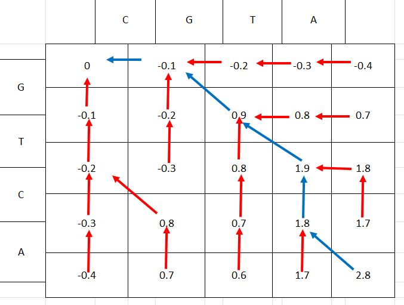

# 1

`ABCDE`

`BCDEF`

Hamming distance=5

Edit distance=2

---

# 2
## a

The Needleman-Wunsch algorithm can be used to solve the LCS problem by using a scoring matrix with some finite value (e.g., +1) along the main diagonal, and -$\infty$ everywhere else. This has the effect of banning substitutions. The gap penalty can be any number > -1.

## b

Shown with $d=0.1$



`CGT-A`

`-GTCA`

---

# 3

## a

Initialisation:

 - Leading and trailing gaps have a score of zero

 - $F(i, 0) = F(0, j) = 0$

Update:

 - Negative scores are set to zero, and pointers pointing to a score of zero have some new value, `STOP`

 - When tracing back, start from the greatest score cell rather than the bottom-left corner

Termination:

 - When tracing back, stop when you reach a `STOP` pointer.

The time and storage complexities are the same

## b

Initialisation:

 - Instead of $d$ being the cost for any indel, $d$ is now the cost for the first consecutive indel and $e$ is the cost for each subsequent indel.

 - $F(i, 0) = d + (i-1) e$

 - $F(0, j) = d + (j-i) e$

Update:

 - Two scores are now kept &mdash; $F$ for alignments/substitutions from the previous step, and $G$ for indels from the previous step

 - $F(i, j) = \max\left(\begin{smallmatrix} F(i-1, j-1) + s(x_i, y_j)\\ G(i-1, j-1) + s(x_i, y_j) \end{smallmatrix}\right)$

  - $G(i, j) = \max\left(\begin{smallmatrix} F(i-1, j) + d\\ F(i, j-1) + d \\ G(i-1, j) + e \\ G(i, j-1) + e \end{smallmatrix}\right)$

Termination:

 - Same

The time and storage complexities are the same (although storage has gone up by a factor of ~2)

# c

Same as b except:

Initialisation:

 - $F$ and $G$ are undefined for $i,j>k$

Update:

 - When calculating the 4 possibilities for $G(i,j)$, ignore any which are out of bounds.

Termination:

 - Same

Time and storage complexities are $\mathcal{O}\left(\sqrt{M^2+N^2} \times k(M, N)\right)$ ($\approx \mathcal{O}\left(N+k(N)\right)$ if $M\approx N$) which is a significant reduction from $\mathcal{O}(MN)$

---

# 4

## a

The Hirschberg algorithm is similar to the Needleman-Wunsch algorithm, but takes advantage of the fact that when computing $F(i, j)$, only rows $F(\_, j)$ and $F(\_, j-1)$ are necessary. Therefore, instead of having $F$ be an $(M+1)\times (N+1)$ matrix, it is instead an $(M+1) \times 2$ matrix (without loss of generality, assume that $M$ is the length of the shortest input string, $v$). The update step looks as follows:

$F(i, 1) = \max\left(\begin{smallmatrix}F(i, 0) + d \\ F(i-1, 1) + d \\ F(i-1, 0) + s(v_i, w_j)\end{smallmatrix}\right)$

After which, row $F(\_, 1)$ is copied into row $F(\_, 0)$.

$j$ is then incremented and the update cycle repeats.

This means that while the time complexity is still $\mathcal{O}(NM)$, the space complexity has been reduced to $\mathcal{O}(M)$, as this is approximately constant-proportional to the size of the score matrix.

## b

Use the Hirschberg algorithm to find the last row of the score matrix, but also to find the last row of the pointer matrix.

Then backtrack as normal, but if the pointer points up or diagonally, then use the Hirschberg algorithm again to get the previous row. Repeat until backtracking has finished.

The storage complexity is therefore $\mathcal{O}(M)$, and the time complexity is $\mathcal{O}(M\times N^2)$

```python
UP = 0
LEFT = 1
DIAG = 2

def kth_row_of_score(k, v, w, s, d=0.1):
    # Standard Hirschberg algorithm to find the kth row of F
    # but also finds the kth row of Ptr
    M = len(v)

    Ptr = np.zeros((2, M+1))
    Ptr[0, :] = LEFT
    Ptr[1, 0] = UP

    F = np.zeros((2, M+1))
    for i in range(M+1):
        F[0, i] = -i * d

    for j in range(1, k+1):
        F[1, 0] = -d * j
        for i in range(1, M+1):
            options = np.array([
                F[0, i] - d,
                F[1, i-1] - d,
                F[0, i-1] + s[v[i-1]][w[j-1]]
            ])

            F[1, i] = np.max(options)
            Ptr[1, i] = np.argmax(options)
    
        F[0, :] = F[1, :]
        Ptr[0, :] = Ptr[1, :]
    
    return F[0, :], Ptr[0, :]

def global_alignment(v, w, s, d=0.1):
    M, N = len(v), len(w)
    V_ = ""
    W_ = ""
    
    i = M
    j = N

    # Get the last row of the score matrix and pointers
    F, Ptr = kth_row_of_score(j, v, w, s, d=d)
    score = F[i]
    while j > 0 or i > 0:
        # Normal backtracking, but if the pointer points
        # UP or DIAG, then fetch the previous row of the
        # score matrix and the pointers
        ptr = Ptr[i]
        if ptr == UP:
            j -= 1
            V_ = "-" + V_
            W_ = w[j] + W_
            F, Ptr = kth_row_of_score(j, v, w, s, d=d)
        elif ptr == LEFT:
            i -= 1
            V_ = v[i] + V_
            W_ = "-" + W_
        else:
            assert ptr == DIAG
            i -= 1
            j -= 1
            assert v[i] == w[j]
            V_ = v[i] + V_
            W_ = w[j] + W_
            F, Ptr = kth_row_of_score(j, v, w, s, d=d)
    
    return (V_, W_, score)

```

---

# 5

The Nussinov algorithm is used to compute optimal structures for a string of RNA (i.e., which bases will pair with which other bases). It fundamentally models RNA molecules as two-dimensional, and it does not account for minimum loop sizes.

Time complexity: $\mathcal{O}(n^3)$

Storage complexity: $\mathcal{O}(n^2)$

---

# 6

The Four Russians method consists of splitting a value matrix (say, of size $n\times n$) into blocks of size $t\times t$ (where typically $t=\ln n$), with the hope that the problem can be solved quickly on those blocks using a lookup table.

This can reduce the time complexity of a problem from $\mathcal{O}\left(f(n)n^2\right)$ to $\mathcal{O}\left(f(\ln n)\left(\frac{n}{\ln n}\right)^2\right)$

This can be applied to problems involving matrices whose elements can have a finite number of values.

---

# 7

Additive Phylogeny relies on the distance matrix being additive, whereas UPGMA and Neighbor Joining can produce a result even when the matrix is not additive. That being said, the logic behind Neighbor Joining does make the assumption that the distance matrix is additive.

Additive Phylogeny and Neighbor Joining both fit a tree to the distance matrix when the distance matrix is additive, and neighbor joining provides a good heuristic even when the distance matrix is not additive. However, UPGMA is not guaranteed to fix a tree perfectly to an additive distance matrix.

| **Algorithm** | **Time Complexity** | **Storage Complexity** |
|---|---|---|
| Additive Phylogeny | $\mathcal{O}(n^3)$ | $\mathcal{O}(n^2)$ |
| UPGMA | $\mathcal{O}(n^3)$ | $\mathcal{O}(n^2)$ |
| Neighbor Joining | $\mathcal{O}(n^3)$ | $\mathcal{O}(n^2)$ |

The trees below have nodes labelled `{distance to parent}: {node name}` with the parents shown above their children. The parent-child relationship is purely to aid drawing, as these are unrooted non-directional trees.

```
Additive Phylogeny (Same result as Neighbor Joining)

 C                                                 
 └─────────────────┐                               
                2.0: C.1                           
          ┌────────┴─────────────────┐             
        7.0: D                   2.0: C.1.1        
                            ┌────────┴────────┐    
                          1.0: B            5.0: A 
```

```
UPGMA

       {D,{A,{B,C}}}                                           
    ┌────────┴─────────────────┐                               
  5.5: D                1.75: {A,{B,C}}                        
                      ┌────────┴─────────────────┐             
                   3.75: A                  1.25: {B,C}        
                                        ┌────────┴────────┐    
                                      2.5: B            2.5: C 
```

```
Neighbor Joining (Same result as Additive Phylogeny)
                     m.0                              
    ┌───────────┬─────┴─────────────────┐             
  5.0: A      1.0: B                 2.0: m.1         
                               ┌────────┴────────┐    
                             2.0: C            7.0: D 
```

---

# 8

```
 C                                                 
 └─────────────────┐                               
                2.0|                          
          ┌────────┴─────────────────┐             
        7.0: D                   2.0 |       
                            ┌────────┴────────┐    
                          1.0: B            5.0: A 
```

This tree corresponds to the matrix given in question 7. The minimum value in the distance matrix is $D_{B,C}=5$, but the tree does not have $B$ and $C$ as neighbors.