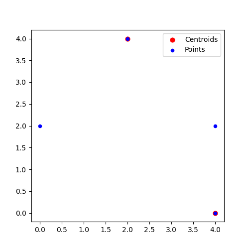
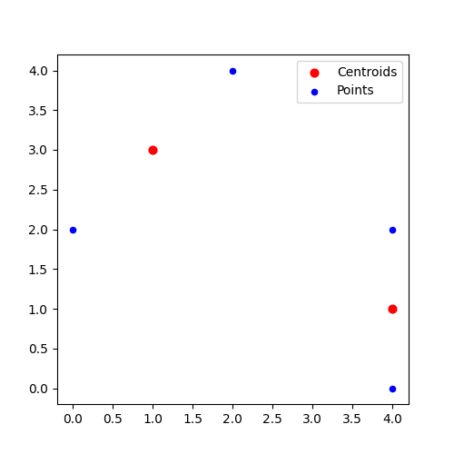

# 1

Input: A rooted binary tree with each leaf labeled
by a single symbol.

Output: A labeling of all other nodes of the tree
by single symbols that minimises the tree’s
parsimony score.

Time Complexity: $\mathbb{O}(mnk^2)$

Where $m$ is the number of species, $n$ is the number of characters, and $k$ is the number of states.

```
                                           T                                           
                   ┌───────────────────────┴───────────────────────┐                   
                   T                                               T                   
       ┌───────────┴───────────┐                       ┌───────────┴───────────┐       
       G                       T                       G                       T       
 ┌─────┴─────┐           ┌─────┴─────┐           ┌─────┴─────┐           ┌─────┴─────┐ 
 G           G           T           G           G           G           T           G 
 ```


# 2

Step 1: Set current tree equal to arbitrary binary rooted
tree structure. ($\mathbb{O}(n + n/2 + n/4 + ...) = \mathbb{O}(n)$)

Step 2: Go through all internal edges and perform all
possible nearest neighbor interchanges. ($\mathbb{O}(n)$)

Step 3: Solve Small Parsimony Problem on each tree. ($\mathbb{O}(n \times nm) = \mathbb{O}(n^2m)$)

Step 4: If any tree has parsimony score improving over
optimal tree, set it equal to the current tree.
Otherwise, return current tree. ($\mathbb{O}(n)$)

# 3

Pick an arbitrary node, and follow an arbitrary unvisited edge to another node. Repeat until the starting node is reached. If there exists an edge which is not in the cycle, pick an arbitrary node in the cycle with at least one unvisited edge and repeat until this node is reached again.

We now have 2 disjunct cycles which intersect at at least one node (the starting node of the second cycle). Therefore these cycles can be combined into one, by following the first cycle, interrupting it when the first node of the second cycle is reached, following the second cycle until we get back to that node, and then continuing the first cycle.

This can be repeated until all edges fall within the cycle.

The time complexity is $\mathbb{O}(V+E)$

# 4&ndash;6

`// TODO`

# 7






## a

Lloyd's algorithm is a greedy algorithm which at each step decreases the cost function (the average distance from each point to the nearest centroid). Therefore it will always converge (but potentially only to a local minimum)

## b

$\mathbb{O}(nkdi)$ where $n$ is the number of points, $k$ is the number of clusters, $d$ is the dimensionality of the points, and $i$ is the number of iterations.

This is linear if we take $i$ to be a constant, but in the worst case $i$ needs to be $\mathbb{\Omega}(2^{\sqrt{n}})$, making Lloyd's algorithm technically superpolynomial.

# 8

The E-step is when the observed data and the parameters are used to calculate an approximation of the hidden matrix

The M-step is when the observed data and the hidden matrix are used to calculate an approximation of the parameters

# 9
```
                       {{C,{B,D}},{A,E}}                                           
             ┌─────────────────┴───────────────────┐                               
           {A,E}                               {C,{B,D}}                 
    ┌────────┴────────┐                  ┌────────┴─────────────────┐              
    A                 E                  C                        {B,D}         
                                                           ┌────────┴────────┐     
                                                           B                 D  
```

## a

Start with the root cluster (`{{C, {B, D}}, {A, E}}`) and subdivide it (`{C, {B, D}}` and `{A, E}`). Then, of those select the one whose children are furthest apart, and subdivide that (`{C}`, `{B, D}`, and `{A, E}`). Repeat until the desired number of clusters are obtained.

## b

Time complexity = $\mathbb{O}(n^2\log n)$

# 10

The input is an undirected graph, and two parameters $e$ (power) and $r$ (inflation). Both parameters are usually set to 2.

The output is a set of clusters.

Step 1: Create the adjacency matrix ($\mathbb{O}(n^2)$)

Step 2: Normalize the adjacency matrix ($\mathbb{O}(n^2)$)

Step 3: Expand by raising the matrix to the power of $e$ ($\mathbb{O}(n^3)$ if $e$ is considered a constant and is an integer)

Step 4: Inflate by raising the matrix to the power of $r$ amd normalizing ($\mathbb{O}(n^2)$ if $r$ is considered a constant and is an integer)

Step 5: Repeat from step 4 until the matrix converges

Step 6: Calculate the disjoint sections of the adjacency matrix ($\mathbb{O}(n^2)$). These are the clusters.