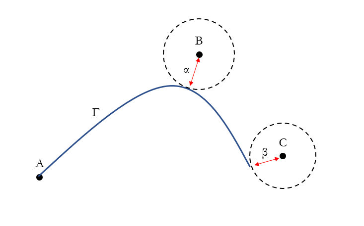

# Introduction and Description

This project explores algorithms to approximate solutions to a continuous variant of the Travelling Salesman Problem.

In this variant, the cities are embedded in a continuous space (the domain). The domain must be connected (i.e., for any two points in the domain, there exists a path between them which is fully contained within the domain). There is a real-valued, continuous cost density function defined over this domain, and the cost of a given path (the terms *path* and *contour* will be used interchangeably) is defined by the integral of the cost density function along the contour. The goal is to find the contour inside the domain which gets as close as possible to every city, with the minimum cost.

In the discrete TSP, approximate solutions are Hamiltonian paths. The total cost of the approximation is solely based on the total cost of this path.

However, in the continuous variant, the total cost of an approximate solution can be measured by *two* statistics. One is the cost of the contour (as defined above). The second comes from the fact that the cities exist in a continuous domain. This means that a contour can get arbitrarily close to a city without passing through it, and so the total cost of the approximation can depend on how close the contour comes to each of the cities.

To quantify this, we define the total cost of an approximate solution to be equal to the cost of the contour, *plus* a "near-miss tax". This tax is the sum of the distances (according to a given distance metric) of closest approach between the contour and each of the cities.

An example is shown below



In this example, the cost of the shown solution would be the integral of the cost density function along $\Gamma$, plus $\alpha$, plus $\beta$.

A precise definition of both the discrete and continuous variants of the TSP as they will be used in this project are given below:

## Definition of the Discrete TSP

Given:

 - A set of points $S$
 - A cost total function $C : S \times S \rightarrow \mathbb{R}$ with the following property:

     - $\forall A \in S.\;\;\; C(A,A)=0$

Find:

 - A route $Y\in S^n$ where $n \geq |S|$ with the following properties:

     - $\forall A \in S.\;\;\;A \in Y$
     - $\sum_{i=0}^{n-2} C(Y_i, Y_{i+1})$ is minimised

An instance of the discrete TSP can be parameterised by $(S,C)$ and the solution is $Y$.

## Definition of the Continuous TSP

Given:

 - A continuous connected domain $D$
 - A finite set of points $S' \subseteq D$
 - A continuous cost density total function $f : D \rightarrow \mathbb{R}$
 - A distance metric $\Delta : D \times D \rightarrow \mathbb{R}$ satisfying the following properties:
     - $\forall A \in D.\;\;\;\Delta(A,A)=0$
     - $\forall A, B, C \in D.\;\;\;\Delta(A,B)+\Delta(B,C)\geq\Delta(A,C)$ (the triangle inequality)

Find:

 - A contour $Y' \subseteq D$ with the following properties:

     - $\forall A' \in S'.\;\;\;A' \in Y'$
     - $\left(\int_{Y'} f(z)\; dz\right) + \sum_{A\in S}\min(\{\Delta(A,X) \mid \forall X \in Y' \})$ is minimised

An instance of the continuous TSP can be parameterised by $(D,S',f,\Delta)$ and the solution is $Y'$.

##

It should be noted that approximate solutions to the continuous TSP do not necessarily map onto approximate solutions to the discrete TSP. The goal of this project is not to use the continuous variant in order to better solve the discrete variant, but instead to explore the continuous TSP in its own right.

The main deliverable of this project is a collection of algorithms which approximate solutions to the continuous TSP. Some of these algorithms will be existing approximations to the discrete TSP but generalised to the continuous variant (such as Ant Colony Optimisation [@brezina2011solving] and the Slime Mold Algorithm [@slime]). Some research has been done into similarly-defined continuous variant of the TSP [@andrews2007fast], but an extension to this project will be for at least one of the delivered implementations to be a novel algorithm specifically tailored to the continuous case. For the novel algorithm/s, the dissertation will include the detailed mathematical and logical reasoning behind them.

These algorithms will be evaluated on the following metrics:

 - The relative cost of the approximate solutions found by the algorithm
 - The time complexity of the algorithm
 - The space complexity of the algorithm
 - The parallelisability of the algorithm

This project will also contain a proof that an instance of the discrete TSP can be transformed into an instance of the continuous TSP, and the solution of the latter can be transformed back into the solution of the former.

A result of this fact is that the continuous TSP is at least as hard as the discrete TSP. As such, the solutions found by the algorithms will not be comparable to some "ground truth" perfect solution, so they will instead be compared to one another.

The algorithms will be implemented in Python. The cost function and distance metric inputs to the algorithm will be represented using either SymPy [@10.7717/peerj-cs.103] or TensorFlow [@tensorflow2015-whitepaper] variables (or something similar) as they use symbols to represent mathematical relationships between variables. This allows the cost function and distance metric to be represented as pure mathematical functions. These symbolic maths libraries also allow for integrals and derivatives to be performed on variables with respect to other variables, and for differential equations to be solved. An example using SymPy is shown below, but TensorFlow allows us to do similar things.

```python
from sympy import symbols, integrate

# suppose the cost function is defined on R^2
x1, x2 = symbols("x1 x2")

# the cost function is the square distance from the origin
y = x1 * x1 + x2 * x2

# if we wanted to e.g. integrate y with respect to x1 as x1 goes from -2 to 2:
print(integrate(y, (x1, -2, 2)))
# prints: "4*x2**2 + 16/3"
```

The domain will either be defined in a similar way, or will not need to be explicitly defined at all. (Note how in the above example, the domain is implicitly defined as the set of all pairs of values for `x1` and `x2`)

# Starting Point

There is no existing code or materials forming the basis of this project. This is a project I first started thinking about approximately a year ago, but I have made no serious attempts at solving it.

# Success Criterion

This project will be a success if I am able to deliver at least three implementations of algorithms to approximate solutions to the continuous TSP. The implementations need to work when all of the following conditions are met:

 - The domain is $\mathbb{R}^2$
 - The distance metric is Euclidean
 - The cost function is differentiable

# Work Plan

| **Work Package** | **Description** | **Deliverables** | **Deadline** |
|---|---|---|---|
| 0 | Research algorithms to approximate discrete TSP | Have a list of existing TSP algorithms which can be generalised to the continuous variant (a generalised algorithm) | 23/10/22 |
| 1 | Research algorithms to approximate continuous variants of discrete problems | Be able to describe a rough outline of at least one algorithm which approximates a solution to the continuous variant (a direct algorithm)  | 06/11/22 |
| 2 | Continue research and start implementation of generalised algorithms | Have at least one generalised algorithm implemented and working | 20/11/22 |
| 3 | Continue research and, continue implementation of generalized algorithms, start implementation of novel algorithms | Have every generalised algorithm from the list from Work Package 0 implemented and working | 04/12/22 |
| 4 | Write progress report, continue implementation of novel algorithms | Have at least one direct algorithm implemented and working, and submit progress report | 18/12/22 |
| 5 | Optimise novel algorithm | Have at least one direct algorithm implemented efficiently | 08/01/23 |
| 6 | Perform evaluation of algorithms | Produce a written comparison of all implemented algorithms containing numerical/statistical analysis as well as a plain english interpretation | 22/01/23 |
| 7 | Write dissertation | Complete draft of chapters 1, 2, and 3 | 05/02/23 |
| 8 | Write dissertation | Complete full draft | 19/02/23 |
| 9 | Write dissertation | Dissertation ready to submit | 05/03/22 |

# Special Resources

Testing of the suite of algorithms will likely require the use of Google CoLab [@Bisong2019] or other similar cloud computing services. Fortunately, I already have a subscription to Google CoLab Pro for personal use, so I do not need the university to provide one.

# References
