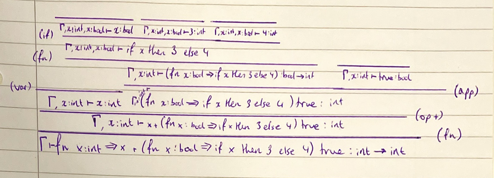

# Semantics supervision 2

## Exercise 18

1. x, z

2. x, z

3. None

4. None

5. y, x

## Exercise 19

1. fn w:int => (fn x:int => y) w

2. fn y:int => (fn z:int => z) y

3. fn x:int => x (fn x:int => x)

## Exercise 20

1. No derivation exists. This is because there is only one type rule which assigns types to expressions of the form if e1 then e2 else e3 (if) and it only applies under the assumption that e1 has the type `bool`, but by rule (int) 6 has type `int` and not `bool`.

2. 

