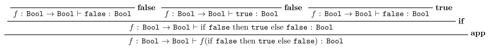
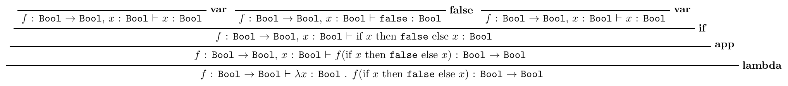

# Supervision 1

## 1.3

### a

### b

## 1.4

Suppose we want to construct a proof that

$\cdot \vdash x : t$

This does not match rule **VAR**, or rule **LAM**. Therefore, it must be of the form of rule **APP**.

Therefore, $x$ must be one of the two terms whose types are derived from **APP**.

### Case 0: $x=E_1$, $t=\tau' \rightarrow \tau$

This would require us to prove that $\cdot \vdash x E_2 : \tau$

### Case 1: $x=E_2$, $t=\tau'$

This would require us to prove that $\cdot \vdash E_1 x : \tau$

In either case, we are left with a problem in the same shape as the original. Therefore, any derivation tree for the type of $x$ would have have to apply **APP** infinitely many times without ever reaching an axiom.

## 1.5

### a

*Lemma 1:* There exists no term $n$ such that $\cdot \vdash n : 0$.

Lemma 1 is analogous to the fact that one cannot prove `false`.

#### Case 0

*Assumption 1:* there exists a term $p$ such that $\cdot \vdash p : \pi$

*Assumption 2:* there exists a term $p'$ such that $\cdot \vdash p' : \pi \rightarrow 0$

By **APP**, $\cdot \vdash p'p : 0$

This violates lemma 1, and so is a contradiction.

This is analogous to to the fact that $P$ and $\neg P$ cannot both be true.

#### Case 1

*Assumption 1:* there does not exist a term $p$ such that $\cdot \vdash p : \pi$

*Assumption 2:* there does not exist a term $p'$ such that $\cdot \vdash p' : \pi \rightarrow 0$

Claim: By assumption 1, $\pi$ is therefore equivalent to $0$. (I don't know how to prove this)

By **LAM**, $\cdot \vdash \lambda x: 0 . x : \pi \rightarrow 0$.

This violates assumption 2, and so is a contradiction

This is analogous to to the fact that $P$ and $\neg P$ cannot both be false.

### b

#### i

Type:

$((\pi \rightarrow 0)\times(\pi'\rightarrow 0))\rightarrow((\pi+\pi') \rightarrow 0)$

Term:

$\lambda x: ((\pi\rightarrow 0)\times(\pi'\rightarrow 0)).\; (\lambda y: (\pi+\pi').\; \textrm{case}(y, \textrm{L}y_1 \rightarrow (\textrm{fst }x)y_1, \textrm{R}y_2 \rightarrow (\textrm{snd }x)y_2))$

#### ii

Type:

$((\pi+\pi') \rightarrow 0)\rightarrow((\pi \rightarrow 0)\times(\pi'\rightarrow 0))$

Term:

$\lambda y: ((\pi+\pi')\rightarrow 0).\; <\lambda x_1: \pi.\; y\textrm{L}x_1, \lambda x_2: \pi'.\; y\textrm{R}x_2>$

#### iii

Type:

$((\pi\rightarrow 0)+(\pi'\rightarrow 0)) \rightarrow ((\pi\times\pi')\rightarrow 0)$

There is not a term which has this type

#### iv

Type:

$((\pi\times\pi')\rightarrow 0)\rightarrow((\pi\rightarrow 0)+(\pi'\rightarrow 0))$

There is not a term which has this type

### c

This means that the correspondence between STLC and propositional logic is not perfect. Specifically, there are some propositions which are provable in propositional logic, such that the STLC has no terms of the corresponding type.

## 1.6

Proof that if $\Gamma \vdash x:\tau$, then $fv(x)\subseteq dom(\Gamma)$.

### Case 0: $1I$

$x=<>$.

Therefore $fv(x)=\{\}\subseteq dom(\Gamma)$

### Case 1: $\times I$

$x=<e,e'>$

By induction, $fv(e)\subseteq dom(\Gamma)$

By induction, $fv(e')\subseteq dom(\Gamma)$

$fv(x)=fv(e)\cup fv(e')$

Therefore, $fv(x)\subseteq dom(\Gamma)$

### Case 2: $E_1$

$x=\textrm{fst }e$

By induction, $fv(e)\subseteq dom(\Gamma)$

$fv(x)=fv(e)$

Therefore, $fv(x)\subseteq dom(\Gamma)$

### Case 3: $E_2$

$x=\textrm{snd }e$

By induction, $fv(e)\subseteq dom(\Gamma)$

$fv(x)=fv(e)$

Therefore, $fv(x)\subseteq dom(\Gamma)$

### Case 4: $Hyp$

$x: \tau \in \Gamma$

Therefore $x \in dom(\Gamma)$

Claim: $fv(x) = \{x\}$ (I don't know how to prove this)

Therefore $fv(x) \subseteq dom(\Gamma)$

### Case 5: $\rightarrow I$

$x=\lambda y: T.\; e$

By induction, $fv(e) \subseteq (dom(\Gamma) \cup \{y\})$

$fv(x) = fv(e) \setminus \{y\}$

Therefore, $fv(x) \in dom(\Gamma)$

### Case 6: $\rightarrow E$

$x=ee'$

By induction, $fv(e)\subseteq dom(\Gamma)$

By induction, $fv(e')\subseteq dom(\Gamma)$

$fv(x)=fv(e)\cup fv(e')$

Therefore, $fv(x)\subseteq dom(\Gamma)$

### Case 7: $+I_1$

$x=\textrm{L}e$

By induction, $fv(e)\subseteq dom(\Gamma)$

$fv(x)=fv(e)$

Therefore, $fv(x)\subseteq dom(\Gamma)$

### Case 8: $+I_2$

$x=\textrm{R}e$

By induction, $fv(e)\subseteq dom(\Gamma)$

$fv(x)=fv(e)$

Therefore, $fv(x)\subseteq dom(\Gamma)$

### Case 9: $+E$

$x=\textrm{case}(e, \textrm{L}y\rightarrow e', \textrm{R}z\rightarrow e'')$

By induction, $fv(e) \subseteq dom(\Gamma)$

By induction, $fv(e') \subseteq (dom(\Gamma) \cup \{y\})$

By induction, $fv(e'') \subseteq (dom(\Gamma) \cup \{z\})$

$fv(x)= fv(e) \cup (fv(e') \setminus \{y\}) \cup (fv(e'') \setminus \{z\})$

Therefore, $fv(x)\subseteq dom(\Gamma)$

### Case 10: $+E$

$x=\textrm{abort }e$

By induction $fv(e)\subseteq dom(\Gamma)$

$fv(x)=fv(e)$

Therefore, $fv(x)\subseteq dom(\Gamma)$

### Conclusion

Suppose $\Gamma=\cdot$

Therefore, $fv(x) \subseteq dom(\cdot)$

Therefore, $fv(x) \subseteq \emptyset$

Therefore, $fv(x) = \emptyset$

Therefore $x$ has no free variables.